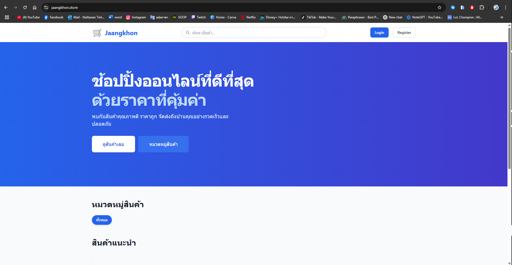

# Jaangkhon Marketplace - Frontend
## Overview
Jaangkhon Marketplace เป็นแพลตฟอร์มซื้อขายสินค้าออนไลน์ที่สร้างด้วย Next.js และ TypeScript พร้อมด้วย Tailwind CSS สำหรับการจัดการส่วนของ UI

## ตัวอย่างเว็บ

# การติดตั้ง

## โดยคุณสามารถติดตั้งแล้วรันใน Localhost หรือว่า ไปที่ https://jaangkhon.store/ (ยังอยู่ในการพัฒนาไม่สมบูรณ์เท่าติดตั้งเอง)

## ติดตั้งเอง

Clone repository:

bashCopygit clone https://github.com/your-username/jangkhon-marketplace.git
cd jangkhon-marketplace

ติดตั้ง dependencies:

bashCopynpm install

## หรือ
yarn install

สร้างไฟล์ .env.local และกำหนดค่า environment variables:

CopyNEXT_PUBLIC_API_URL=http://localhost:5000/api

# คุณสมบัติหลัก

การลงทะเบียนและเข้าสู่ระบบ: ผู้ใช้สามารถสร้างบัญชีใหม่และเข้าสู่ระบบได้
ค้นหาและกรองสินค้า: ค้นหาสินค้าด้วยคำสำคัญและกรองตามหมวดหมู่
หน้าสินค้า: ดูรายละเอียดสินค้าแต่ละรายการ
ระบบตะกร้าสินค้า: เพิ่มสินค้าลงในตะกร้า (จะพัฒนาในอนาคต)
โปรไฟล์ผู้ใช้: จัดการข้อมูลส่วนตัวและประวัติการสั่งซื้อ (จะพัฒนาในอนาคต)

# สถาปัตยกรรมและเทคโนโลยี
## Frontend

Next.js: React framework ที่มี server-side rendering และ static generation
TypeScript: ใช้สำหรับ type safety และการพัฒนาที่มีประสิทธิภาพ
Tailwind CSS: Utility-first CSS framework สำหรับการออกแบบ UI ที่ตอบสนองและปรับแต่งได้
Context API: ใช้สำหรับการจัดการสถานะ authentication และข้อมูลผู้ใช้

## API Integration

การสื่อสารกับ backend ผ่าน RESTful APIs
การจัดการ tokens และ authentication headers
Error handling และการจัดการ loading states

## Authentication Flow

## การลงทะเบียน:

ผู้ใช้กรอกข้อมูลในฟอร์มลงทะเบียน
Frontend ส่งข้อมูลไปยัง API endpoint /api/auth/register
หลังจากลงทะเบียนสำเร็จ ผู้ใช้จะถูกนำไปยังหน้าเข้าสู่ระบบ

## การเข้าสู่ระบบ:

ผู้ใช้กรอกข้อมูลในฟอร์มเข้าสู่ระบบ
Frontend ส่งข้อมูลไปยัง API endpoint /api/auth/login
เมื่อเข้าสู่ระบบสำเร็จ token และข้อมูลผู้ใช้จะถูกเก็บใน localStorage
AuthContext จะอัปเดตสถานะการเข้าสู่ระบบและข้อมูลผู้ใช้

## การตรวจสอบสถานะการเข้าสู่ระบบ:

AuthContext ตรวจสอบ token ใน localStorage เมื่อแอปพลิเคชันโหลด
ถ้ามี token จะตั้งค่าสถานะ isAuthenticated เป็น true

## การออกจากระบบ:

การคลิกที่ปุ่ม "ออกจากระบบ" จะลบ token จาก localStorage
AuthContext จะอัปเดตสถานะการเข้าสู่ระบบเป็น false

## การจัดการสินค้า

หน้าหลักแสดงรายการสินค้าทั้งหมดที่ดึงจาก API
การกรองสินค้าตามหมวดหมู่ผ่านการส่งพารามิเตอร์ไปยัง API endpoint
การเพิ่มสินค้าลงในตะกร้าหรือการดูรายละเอียดเพิ่มเติมเมื่อคลิกที่สินค้า

Components
Header (header.tsx)

แสดงเมนูนำทางและสถานะการเข้าสู่ระบบ
มีฟอร์มค้นหาสินค้า
แสดงตัวเลือกที่แตกต่างกันสำหรับผู้ใช้ที่เข้าสู่ระบบแล้วและยังไม่ได้เข้าสู่ระบบ

## AuthContext (AuthContext.tsx)

จัดการสถานะการเข้าสู่ระบบทั่วทั้งแอปพลิเคชัน
ให้บริการฟังก์ชัน login, register และ logout
ตรวจสอบ token ใน localStorage เพื่อรักษาสถานะการเข้าสู่ระบบ

## API Services

api.ts: ฟังก์ชันพื้นฐานสำหรับการส่ง HTTP requests
auth.service.ts: บริการเฉพาะสำหรับการลงทะเบียนและการเข้าสู่ระบบ
product.service.ts: บริการสำหรับการดึงข้อมูลสินค้า
